<!-- graphe de contributions animé : données réelles, cellules révélées une à une
     (régénéré quotidiennement par .github/workflows/update-profile-art.yml) -->

<h3><code>alexis@github ~ $ ./contributions.sh</code></h3>

 
 

<!-- hero : portrait ASCII monochrome (frappé à l'écran) à côté d'un panneau
     façon neofetch. régénérer le portrait : python scripts/prep_photo.py <photo> &&
     python scripts/make_ascii_svg.py ; panneau info : python scripts/make_info_card.py -->

<h3><code>alexis@github ~ $ whoami</code></h3>

<table>
<tr>
<td valign="top"></td>
<td valign="top"></td>
</tr>
</table>

 
 

<h3><code>alexis@github ~ $ ./links.sh</code></h3>

<b>Développeur full-stack Node.js &amp; Next.js · Freelance</b>

 

---

**Vous avez une idée SaaS à lancer, un outil interne à moderniser ou des processus à automatiser ?**  
Je construis des applications web fiables et durables, du back-end à l'interface utilisateur.

---

## 🧭 Profil

Développeur **full-stack freelance** spécialisé en **Node.js**, **Next.js** et **TypeScript**, avec **6 ans d'expérience** sur des projets variés :  
- SaaS B2B  
- CRM et outils internes  
- plateformes de réservation  
- automatisation métier  

> *Piloting systems, building futures.*  
> Mon approche technique s'inspire de l'aviation : fiabilité, anticipation, clarté.

---

## 🧰 Stack & outils

| Domaine             | Outils & technologies |
|---------------------|------------------------|
| **Back-end**        | Node.js, Supabase, PostgreSQL, Prisma, Zod |
| **Front-end**       | Next.js (App Router), TypeScript, Tailwind, ShadCN/UI |
| **Testing**         | Vitest, Playwright |
| **DevOps**          | GitHub Actions, Sentry, Cloud Run, Railway |
| **Produit**         | Figma, Notion, Linear |

---

## ✅ Ce que j'apporte

- **Back-end solide** : API claires, validation stricte, sécurité intégrée  
- **Front-end fluide** : interfaces Next.js rapides, UI accessible et personnalisée  
- **Qualité garantie** : tests unitaires & e2e, CI/CD automatisée  
- **Produit utile** : UX pensée pour l'utilisateur, automatisations métiers

---

## ✨ Projets récents

### **Aizily** – SaaS IA
- Gestion d'erreurs avec Sentry + dashboards temps réel  
- Résultat : stabilité accrue et support réactif  

### **Keyni** – Gestion locative
- Tests automatisés + pipeline CI/CD complet  
- UI Next.js optimisée mobile  

### **Tambè** – Gestion d'atelier
- CRM structuré et évolutif  
- Gestion multi-utilisateurs et exports dynamiques  

---

## 📐 Méthodologie

1. Cadrage & compréhension du besoin  
2. Architecture claire et prototypage rapide  
3. Développement itératif avec feedback continu  
4. Livraison documentée & accompagnement post-lancement  

---

## 📈 Résultats obtenus

- **+30% de productivité** via automatisations  
- **Zéro bug critique** en production pendant 3 mois consécutifs  
- **Livraisons rapides** grâce à des pipelines fiables  

---

## 📬 Contact

- **Email** : [hello@alexismaison.com](mailto:hello@alexismaison.com)  
- **LinkedIn** : [linkedin.com/in/alexis2m](https://www.linkedin.com/in/alexis2m)  
- **Site** : bientôt disponible sur [alexismaison.com](https://alexismaison.com)

---

> *Votre idée mérite un socle technique solide. Je peux le construire avec vous.*
